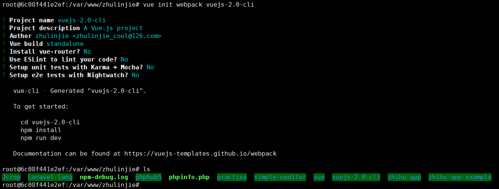

#使用 Vue 脚手架工具进行组件化开发

> https://github.com/vuejs/vue-cli
>https://github.com/webpack/webpack

npm install -g vue-cli --registry https://registry.npm.taobao.org
npm install --global webpack --registry https://registry.npm.taobao.org

vue init webpack vuejs-2.0-cli

cd vuejs-2.0-cli/
npm install --registry https://registry.npm.taobao.org
