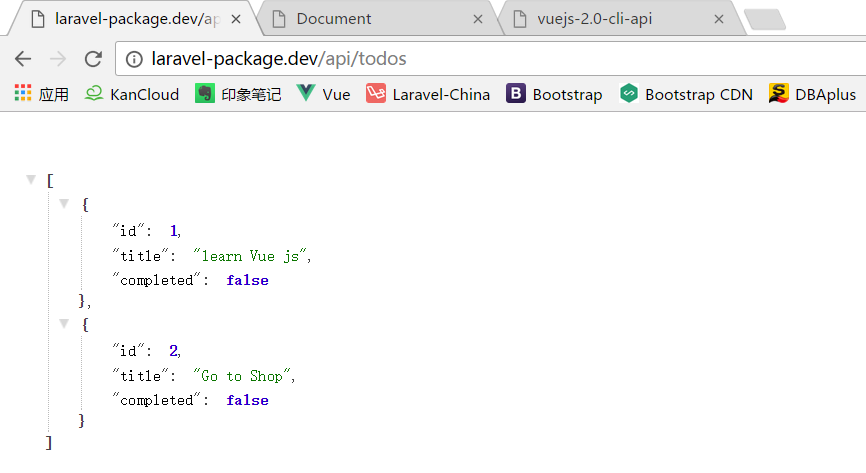
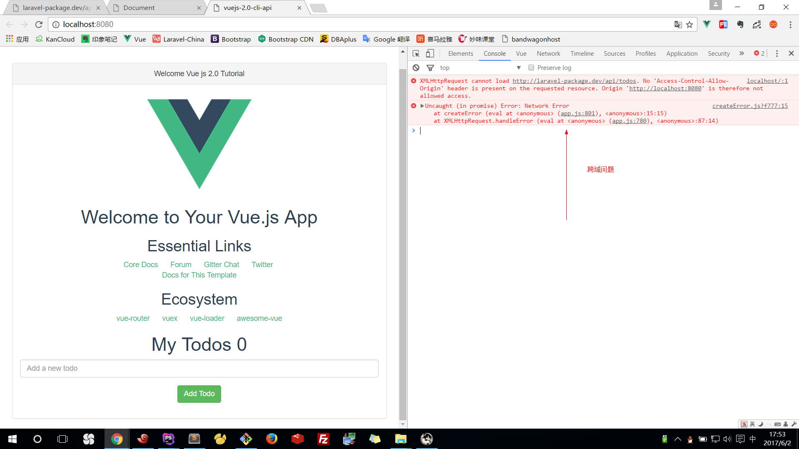

#Vuejs 和 Laravel API 前后端分离

>https://github.com/imcvampire/vue-axios
>https://github.com/barryvdh/laravel-cors

新建一个laravel5.3项目 laravel-package
api.php
```
Route::get('/todos', function(){
    return response()->json([
        ['id' => 1, 'title' => 'learn Vue js', 'completed' => false],
        ['id' => 2, 'title' => 'Go to Shop', 'completed' => false],
    ]);
})->middleware('api');
```
浏览器访问测试：http://laravel-package.dev/api/todos



vue init webpack vuejs-2.0-cli-api
cd vuejs-2.0-cli-api/
npm install --registry https://registry.npm.taobao.org
npm run dev

同上一节，把之前的组件融合到这个项目中

npm install --save axios vue-axios --registry https://registry.npm.taobao.org

App.vue
```
<script>
  import Hello from './components/Hello'
  import Todos from './components/Todos'
  import TodoForm from './components/TodoForm'

  export default {
    name: 'app',
    data(){
      return {
        message: 'My Todos',
        todos: []
      }
    },
    mounted(){
      this.axios.get('http://laravel-package.dev/api/todos').then(response=>{
        this.todos = response.data;
        console.log(response);
      });
    },
    computed: {
      todoCount(){
        return this.todos.length;
      }
    },
    components: {
      Hello, Todos, TodoForm
    }
  }
</script>
```

接下来就遇到跨域问题



cd laravel-package/
composer require barryvdh/laravel-cors

config/app.php
```
'providers' => [
	...
    Barryvdh\Cors\ServiceProvider::class,
    ...
],
```

app/Http/Kernel.php
```
protected $routeMiddleware = [
    ...
    'cors' => \Barryvdh\Cors\HandleCors::class,
];
```

