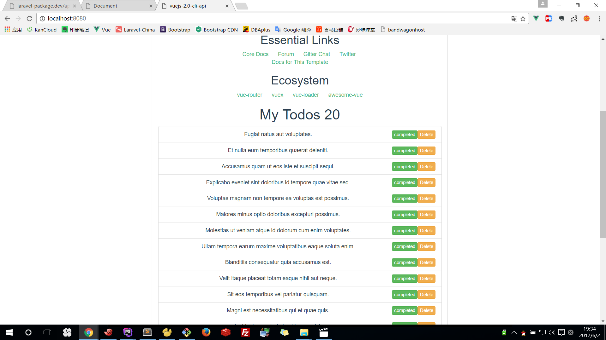

#Vuejs 2.0 使用 vue-router 处理前端路由

>https://github.com/vuejs/vue-router

cd laravel-package/
php artisan make:model Todo -m

2017_06_02_110139_create_todos_table.php
```
public function up()
{
    Schema::create('todos', function (Blueprint $table) {
        $table->increments('id');
        $table->string('title');
        $table->tinyInteger('completed')->default(0);
        $table->timestamps();
    });
}
```

php artisan migrate

Todo.php
```
protected $fillable = ['title'];
```

php artisan tinker
namespace App
factory(Todo::class, 20)->create()

api.php
```
Route::get('/todos', function(){
    $todos = \App\Todo::all();
    return $todos;
})->middleware('cors:api');
```



npm install vue-router --registry https://registry.npm.taobao.org

src/main.js
```
import Vue from 'vue'
import axios from 'axios'
import VueAxios from 'vue-axios'
import VueRouter from 'vue-router'
import App from './App'
import Todos from './components/Todos'
import Todo from './components/Todo'

Vue.config.productionTip = false

Vue.use(VueAxios, axios)
Vue.use(VueRouter)

const routes = [
  { path: '/', component: Todos },
  { path: '/todo/:id', component: Todo, name: 'todo' }
]

const router = new VueRouter({
  routes // short for routes: routes
})

/* eslint-disable no-new */
new Vue({
  el: '#app',
  template: '<App/>',
  components: { App },
  router
})
```

src/App.vue
```
<template>
  <div class="container" id="app">
    <div class="row">
      <div class="col-md-8 col-md-offset-2">
        <div class="panel panel-default">
          <div class="panel-heading">Welcome Vue js 2.0 Tutorial</div>
          <div class="panel-body">
            
            <hello></hello>
            <h1>{{ message }} {{ todoCount }}</h1>
            <router-view :todos="todos"></router-view>
          </div>
        </div>
      </div>
    </div>
  </div>
</template>

<script>
  import Hello from './components/Hello'

  export default {
    name: 'app',
    data(){
      return {
        message: 'My Todos',
        todos: []
      }
    },
    mounted(){
      this.axios.get('http://laravel-package.dev/api/todos').then(response=>{
        this.todos = response.data;
        console.log(response);
      });
    },
    computed: {
      todoCount(){
        return this.todos.length;
      }
    },
    components: {
      Hello
    }
  }
</script>

<style>
#app {
  font-family: 'Avenir', Helvetica, Arial, sans-serif;
  -webkit-font-smoothing: antialiased;
  -moz-osx-font-smoothing: grayscale;
  text-align: center;
  color: #2c3e50;
  margin-top: 60px;
}
</style>
```

src/compontents/Todos.vue
```
<template>
  <div id="todos">
    <ul class="list-group" v-if="todos.length > 0">
      <li class="list-group-item" v-bind:class="{ 'completed':todo.completed }" v-for="(todo, index) in todos">
        <router-link :to="{ name: 'todo', params: { id: todo.id }}">{{ todo.title }}</router-link>
        <button class="btn btn-warning btn-xs pull-right" v-on:click="deleteTodo(index)">Delete</button>
        <button class="btn btn-xs pull-right" v-bind:class="[todo.completed ? 'btn-danger' : 'btn-success']"
                v-on:click="toggleCompletion(todo)">{{ todo.completed ? 'undo' : 'completed' }}
        </button>
      </li>
    </ul>
    <todo-form :todos="todos"></todo-form>
  </div>
</template>

<script>
  import TodoForm from './TodoForm'
  export default {
    name: 'todos',
    props: ['todos'],
    methods: {
      deleteTodo(index){
        this.todos.splice(index, 1);
      },
      toggleCompletion(todo){
        todo.completed = !todo.completed;
      }
    },
    components: {
      TodoForm
    }
  }
</script>

<!-- Add "scoped" attribute to limit CSS to this component only -->
<style scoped>
  .completed a{
    color: green;
    text-decoration: line-through;
  }
</style>
```

src/compontents/TodoForm.vue
```
<template>
  <form v-on:submit.prevent="addTodo(newTodo)">
    <div class="form-group">
      <input type="text" class="form-control" placeholder="Add a new todo"
             v-model="newTodo.title">
    </div>
    <div class="form-group">
      <button class="btn btn-success" type="submit">Add Todo</button>
    </div>
  </form>
</template>

<script>
  export default {
    props: ['todos'],
    data(){
      return {
        newTodo: {id: null, title: '', completed: false}
      }
    },
    methods: {
      addTodo(newTodo){
        this.todos.push(newTodo);
        this.newTodo = {id: null, title: '', completed: false};
      }
    }
  }
</script>
```

src/compontents/Todo.vue
```
<template>
    <div class="todo">
        <div class="loading" v-if="loading">
            Loading...
        </div>

        <div v-if="error" class="error">
            {{ error }}
        </div>

        <div v-if="todo" class="content">
            <h2>{{ todo.title }}</h2>
        </div>
    </div>
</template>

<script>
    export default {
        data () {
            return {
                loading: false,
                todo: null,
                error: null
            }
        },
        created () {
            // fetch the data when the view is created and the data is
            // already being observed
            this.fetchData()
        },
        watch: {
            // call again the method if the route changes
            '$route': 'fetchData'
        },
        methods: {
            fetchData () {
                this.error = this.todo = null
                this.loading = true
                // replace getPost with your data fetching util / API wrapper
                this.axios.get('http://laravel-package.dev/api/todo/' + this.$route.params.id).then(response=>{
                    console.log(response.data);
                    this.loading = false;
                    this.todo = response.data;
                });
            }
        }
    }
</script>
```
